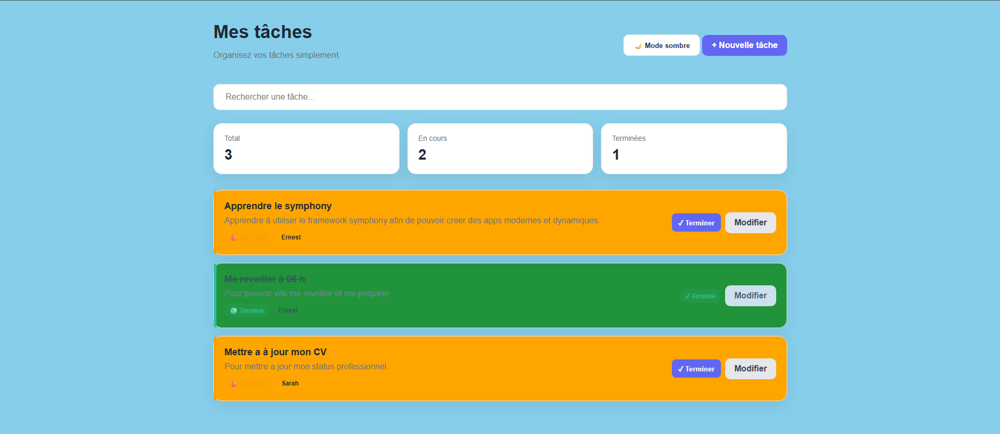
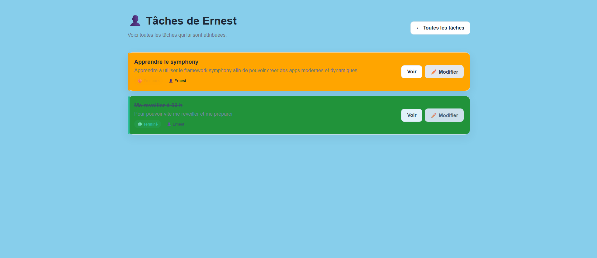

#  TodoList Symfony

> Application web de gestion de tâches développée avec PHP et Symfony.


---

##  Présentation

TodoList Symfony est une application web permettant de créer, consulter, modifier, organiser et suivre l'évolution de tâches.

Le projet a été réalisé dans le but de mettre en pratique les principaux concepts du framework Symfony et de construire progressivement une application complète avec :

- un backend PHP/Symfony ;
- une base de données SQLite ;
- Doctrine ORM ;
- des formulaires Symfony ;
- des templates Twig ;
- du CSS personnalisé ;
- du JavaScript pour les interactions côté client.

L'application permet notamment de gérer le cycle de vie d'une tâche :

```text
🔴 À faire
    ↓
🟠 En cours
    ↓
🟢 Terminé
```

---

#  Fonctionnalités

##  Gestion des tâches

L'application permet de :

- créer une tâche ;
- afficher toutes les tâches ;
- consulter le détail d'une tâche ;
- modifier une tâche ;
- modifier son statut ;
- attribuer une tâche à une personne ;
- afficher toutes les tâches d'une personne ;
- rechercher une tâche ;
- visualiser des statistiques ;
- utiliser un mode sombre ;
- naviguer facilement entre les différentes pages.

---

##  Création d'une tâche

La page de création permet de renseigner :

- **Title** : titre de la tâche ;
- **Content** : contenu ou description ;
- **Status** : état de la tâche ;
- **Assigned To** : personne responsable ;
- **Date** : date associée à la tâche.

Le formulaire est géré avec le composant Form de Symfony.

---

##  Consultation d'une tâche

Chaque tâche possède une page de détail.

Elle permet d'afficher :

- le titre ;
- la description ;
- le statut ;
- la personne assignée ;
- la date ;
- un lien vers la modification ;
- un lien de retour vers la liste.

Le titre d'une tâche depuis la page principale est cliquable afin d'accéder directement à son détail.

---

##  Modification d'une tâche

Une tâche existante peut être modifiée.

Les informations modifiables sont notamment :

- le titre ;
- le contenu ;
- le statut ;
- la personne assignée ;
- la date.

La modification utilise la même structure de formulaire que la création.

Lorsqu'une tâche existante est modifiée, Doctrine effectue simplement un `flush()` sur l'entité déjà gérée.

---

##  Gestion du statut

Les tâches possèdent trois statuts :

| Valeur | Statut | Couleur |
|---:|---|---|
| `0` | 🔴 To Do | Rouge |
| `1` | 🟠 In Progress | Orange |
| `2` | 🟢 Done | Vert |

Depuis la liste des tâches :

```text
To Do
  ↓
Passer en cours
  ↓
In Progress
  ↓
Terminer
  ↓
Done
```

Une tâche terminée est également affichée différemment afin de la distinguer visuellement des autres tâches.

---

##  Gestion des tâches assignées

Chaque tâche peut être associée à une personne via le champ :

```text
AssignedTo
```

Depuis la page de détail d'une tâche, le nom de la personne assignée est cliquable.

Cela permet d'accéder à une page contenant uniquement les tâches de cette personne.

Exemple :

```text
👤 Ernest

├── Apprendre Symfony
├── Créer une application web
└── Améliorer le design
```

---

##  Recherche dynamique

La page principale contient une barre de recherche.

La recherche permet de filtrer les tâches directement côté navigateur en fonction :

- du titre ;
- du contenu.

La recherche utilise JavaScript et ne nécessite pas de rechargement de la page.

---

##  Statistiques

La page principale affiche automatiquement plusieurs informations :

```text
┌─────────────┐
│ Total       │
│     10      │
└─────────────┘

┌─────────────┐
│ En cours    │
│      3      │
└─────────────┘

┌─────────────┐
│ Terminées   │
│      5      │
└─────────────┘
```

Les statistiques sont calculées à partir des tâches récupérées depuis la base de données.

---

#  Interface utilisateur

L'application possède une interface personnalisée en CSS.

L'objectif est de proposer une interface simple, moderne et agréable à utiliser.

## Éléments visuels

L'interface utilise :

- des cartes pour les tâches ;
- des badges de statut ;
- des couleurs différentes selon l'état ;
- des boutons avec effets au survol ;
- des animations ;
- des ombres ;
- des bordures arrondies ;
- une interface responsive ;
- un mode sombre.

---

##  Mode sombre

Un bouton permet d'activer ou de désactiver le mode sombre.

Le choix de l'utilisateur est sauvegardé dans le navigateur avec :

```javascript
localStorage
```

Ainsi, après un rechargement de la page, le thème choisi est conservé.

---

#  JavaScript

Le fichier JavaScript principal est :

```text
public/js/app.js
```

Il gère notamment :

- la recherche instantanée ;
- le mode sombre ;
- la mémorisation du thème ;
- les confirmations lors du changement de statut ;
- les animations des boutons ;
- les notifications de type Toast.

---

#  CSS

Le fichier CSS principal est :

```text
public/css/app.css
```

Il contient le style global de l'application.

Les principales classes utilisées sont notamment :

```text
.container
.app-header
.stats
.stat-card
.todo-list
.todo-card
.todo-todo
.todo-progress
.todo-done
.todo-info
.todo-actions
.badge
.badge-todo
.badge-progress
.badge-done
.todo-detail
.detail-section
.btn
.btn-primary
.btn-secondary
.btn-status
.btn-edit
.toast
```

---

#  Architecture du projet

Le projet suit l'architecture MVC utilisée par Symfony.

```text
my_project_directory/
│
├── assets/
│
├── config/
│   ├── packages/
│   ├── routes/
│   └── services.yaml
│
├── migrations/
│
├── public/
│   ├── css/
│   │   └── app.css
│   │
│   └── js/
│       └── app.js
│
├── src/
│   ├── Controller/
│   │   └── ToDoController.php
│   │
│   ├── Entity/
│   │   └── ToDo.php
│   │
│   └── Form/
│       └── ToDoType.php
│
├── templates/
│   ├── base.html.twig
│   │
│   └── to_do/
│       ├── list.html.twig
│       ├── new.html.twig
│       ├── show.html.twig
│       ├── edit.html.twig
│       └── assigned.html.twig
│
├── var/
│   └── data_dev.db
│
├── .env
├── composer.json
├── composer.lock
└── README.md
```

---

#  Entité ToDo

L'entité principale de l'application est :

```text
App\Entity\ToDo
```

Elle contient les propriétés principales suivantes :

```text
id
title
content
status
AssignedTo
date
```

## Exemple de structure

```text
ToDo
│
├── ID
├── Title
├── Content
├── Status
├── AssignedTo
└── Date
```

Le champ `status` utilise les valeurs :

```php
0 => To Do
1 => In Progress
2 => Done
```

---

#  Formulaire Symfony

Le formulaire principal se trouve dans :

```text
src/Form/ToDoType.php
```

Il utilise notamment :

- `TextType`
- `ChoiceType`
- `DateType`
- `SubmitType`

Exemple de gestion du statut :

```php
->add('status', ChoiceType::class, [
    'label' => 'Status',
    'choices' => [
        'To Do' => 0,
        'In Progress' => 1,
        'Done' => 2,
    ],
])
```

Le formulaire utilise l'entité :

```php
ToDo::class
```

grâce à :

```php
'data_class' => ToDo::class
```

---

# Routes de l'application

Les principales routes sont :

| Méthode | URL | Nom | Fonction |
|---|---|---|---|
| `GET` | `/todo/` | `app_to_do_list` | Liste des tâches |
| `GET/POST` | `/todo/new` | `app_to_do_new` | Création |
| `GET` | `/todo/{id}` | `app_to_do_show` | Détail |
| `GET/POST` | `/todo/{id}/edit` | `app_to_do_edit` | Modification |
| `POST` | `/todo/{id}/status` | `app_to_do_status` | Changement de statut |
| `GET` | `/todo/assigned/{assignedTo}` | `app_to_do_assigned` | Tâches assignées |

---

#  Fonctionnement des contrôleurs

Le contrôleur principal est :

```text
src/Controller/ToDoController.php
```

Il utilise notamment :

```php
EntityManagerInterface
```

pour communiquer avec Doctrine et la base de données.

---

##  Liste des tâches

La liste récupère toutes les tâches :

```php
$toDos = $entityManager
    ->getRepository(ToDo::class)
    ->findAll();
```

Puis les transmet au template :

```text
templates/to_do/list.html.twig
```

---

##  Création

Une nouvelle entité est créée :

```php
$toDo = new ToDo();
```

Puis le formulaire est associé à cette entité :

```php
$form = $this->createForm(ToDoType::class, $toDo);
```

Après validation :

```php
$entityManager->persist($toDo);
$entityManager->flush();
```

---

##  Détail

L'application recherche une tâche grâce à son ID :

```php
$toDo = $entityManager
    ->getRepository(ToDo::class)
    ->find($id);
```

Si la tâche n'existe pas, une erreur 404 est retournée.

---

## Modification

Une tâche existante est récupérée puis associée au formulaire :

```php
$form = $this->createForm(ToDoType::class, $toDo);
```

Après validation :

```php
$entityManager->flush();
```

Il n'est pas nécessaire d'utiliser `persist()` pour une entité existante déjà gérée par Doctrine.

---

## Changement de statut

La route de changement de statut utilise une requête `POST`.

Le principe est :

```php
if ($toDo->getStatus() < 2) {
    $toDo->setStatus($toDo->getStatus() + 1);
}
```

Cela permet de faire évoluer automatiquement :

```text
0 → 1 → 2
```

---

# Base de données

Le projet utilise SQLite.

La base de développement se trouve dans :

```text
var/data_dev.db
```

Doctrine permet de gérer la communication entre l'application Symfony et la base de données.

---

#  Migrations

Les modifications de structure de la base de données sont gérées grâce aux migrations Doctrine.

Pour générer une migration :

```bash
php bin/console make:migration
```

Pour appliquer les migrations :

```bash
php bin/console doctrine:migrations:migrate
```

Pour vérifier le schéma :

```bash
php bin/console doctrine:schema:validate
```

---

#  Technologies utilisées

## Backend

- PHP
- Symfony
- Doctrine ORM

## Base de données

- SQLite

## Frontend

- HTML5
- CSS3
- JavaScript
- Twig

## Outils

- Composer
- Symfony CLI
- Git
- GitHub

---

#  Installation

## Prérequis

Avant d'installer le projet, il est nécessaire d'avoir :

- PHP
- Composer
- Symfony CLI
- Git

---

## 1. Cloner le projet

```bash
git clone https://github.com/VOTRE-UTILISATEUR/VOTRE-REPOSITORY.git
```

Puis :

```bash
cd VOTRE-REPOSITORY
```

---

## 2. Installer les dépendances

```bash
composer install
```

---

## 3. Configurer la base de données

Dans `.env`, la connexion peut utiliser SQLite :

```env
DATABASE_URL="sqlite:///%kernel.project_dir%/var/data_dev.db"
```

---

## 4. Créer la base de données

Si la base n'existe pas :

```bash
php bin/console doctrine:database:create
```

---

## 5. Exécuter les migrations

```bash
php bin/console doctrine:migrations:migrate
```

---

## 6. Lancer le serveur

Avec Symfony CLI :

```bash
symfony server:start
```

Ou :

```bash
symfony serve
```

L'application sera accessible à l'adresse indiquée par Symfony, généralement :

```text
http://127.0.0.1:8000
```

---

# 🔧 Commandes utiles

## Voir les routes

```bash
php bin/console debug:router
```

## Vérifier le schéma Doctrine

```bash
php bin/console doctrine:schema:validate
```

## Générer une migration

```bash
php bin/console make:migration
```

## Exécuter les migrations

```bash
php bin/console doctrine:migrations:migrate
```

## Vider le cache

```bash
php bin/console cache:clear
```

## Lancer le serveur

```bash
symfony server:start
```

---

#  Responsive Design

L'application est conçue pour s'adapter aux différentes tailles d'écran.

Sur ordinateur :

```text
┌────────────────────────────────────────────┐
│                Mes tâches                  │
│                                            │
│  Recherche                                 │
│                                            │
│  Total    En cours    Terminées            │
│                                            │
│  ┌──────────────────────────────────────┐  │
│  │ Tâche                     Modifier    │  │
│  └──────────────────────────────────────┘  │
└────────────────────────────────────────────┘
```

Sur mobile, les éléments s'organisent verticalement afin de rester facilement utilisables.

---

#  Sécurité et améliorations possibles

La version actuelle est principalement orientée apprentissage.

Plusieurs améliorations de sécurité pourraient être ajoutées :

- authentification des utilisateurs ;
- gestion des droits ;
- protection renforcée des actions de modification ;
- protection CSRF sur les actions de changement de statut ;
- validation plus poussée des données ;
- système de rôles ;
- séparation des tâches par utilisateur.

---

#  Améliorations futures

Le projet peut continuer à évoluer avec de nombreuses fonctionnalités.

## 🗑️ Suppression

Ajouter la possibilité de supprimer une tâche.

```text
✏️ Modifier
🗑️ Supprimer
```

Une confirmation pourrait être affichée avant la suppression.

---

##  AJAX

Le changement de statut pourrait être effectué sans rechargement de page.

Exemple :

```text
🔴 À faire
      ↓ clic
🟠 En cours
```

La carte pourrait changer directement de couleur avec une animation.

---

##  Notifications

Afficher une notification après une action :

```text
✅ Tâche créée avec succès !
```

ou :

```text
✅ Tâche modifiée avec succès !
```

---

## Calendrier

Ajouter une vue calendrier afin d'afficher les tâches selon leur date.

---

##  Filtres avancés

Ajouter des filtres par :

- statut ;
- personne ;
- date ;
- priorité.

---

## 👥 Utilisateurs

Créer une véritable entité `User` et remplacer le champ texte `AssignedTo` par une relation Doctrine :

```text
User
  ↑
  │
  │ assigned to
  │
ToDo
```

---

##  Priorités

Ajouter différents niveaux de priorité :

```text
🔴 Urgente
🟠 Haute
🟡 Moyenne
🟢 Faible
```

---

## 📎 Pièces jointes

Permettre d'associer des fichiers à une tâche.

---

#  Objectifs pédagogiques

Ce projet permet de travailler les notions suivantes :

### Symfony

- création d'un projet Symfony ;
- routing ;
- contrôleurs ;
- réponses HTTP ;
- formulaires ;
- Twig ;
- organisation MVC.

### Doctrine

- création d'entités ;
- mapping des propriétés ;
- repositories ;
- récupération de données ;
- `persist()` ;
- `flush()` ;
- migrations ;
- relations futures.

### Frontend

- HTML ;
- CSS ;
- responsive design ;
- animations ;
- JavaScript ;
- événements DOM ;
- `localStorage`.

### Gestion de projet

- Git ;
- GitHub ;
- organisation des fichiers ;
- documentation avec README.

---

#  Ce que ce projet permet de démontrer

Ce projet constitue une première application CRUD complète.

CRUD signifie :

```text
C → Create → Créer
R → Read   → Lire
U → Update → Modifier
D → Delete → Supprimer
```

Dans la version actuelle :

```text
CREATE
  ↓
Créer une tâche

READ
  ↓
Afficher les tâches
Afficher le détail
Afficher les tâches assignées

UPDATE
  ↓
Modifier une tâche
Changer son statut

DELETE
  ↓
Fonctionnalité prévue
```

La suppression pourra donc être ajoutée dans une prochaine version afin de compléter le CRUD.

---

# 📸 Aperçu

Une capture d'écran de l'application peut être ajoutée ici :





Il est conseillé de créer le dossier :

```text
docs/
└── screenshot.png
```

puis d'y placer une capture de la page principale.

---

# 📂 Organisation des templates Twig

Les templates de l'application sont organisés ainsi :

```text
templates/
│
├── base.html.twig
│
└── to_do/
    │
    ├── list.html.twig
    │   └── Liste principale
    │
    ├── new.html.twig
    │   └── Création
    │
    ├── show.html.twig
    │   └── Détail
    │
    ├── edit.html.twig
    │   └── Modification
    │
    └── assigned.html.twig
        └── Tâches d'une personne
```

---

# 🔗 Navigation de l'application

Le parcours principal est :

```text
                    ┌──────────────┐
                    │ Liste tâches │
                    └──────┬───────┘
                           │
             ┌─────────────┼─────────────┐
             ↓             ↓             ↓
        Nouvelle        Détail       Assignées
          tâche           │
                          ↓
                       Modifier
                          │
                          ↓
                     Changer statut
```

---

#  Exemple d'utilisation

### 1. Créer une tâche

L'utilisateur se rend sur :

```text
/todo/new
```

Il renseigne les informations puis valide.

---

### 2. Consulter la tâche

La tâche apparaît dans :

```text
/todo/
```

Son titre peut être sélectionné pour accéder au détail.

---

### 3. Modifier la tâche

Depuis le détail :

```text
✏️ Modifier
```

L'utilisateur peut changer les informations.

---

### 4. Faire évoluer le statut

Une tâche :

```text
🔴 To Do
```

peut devenir :

```text
🟠 In Progress
```

puis :

```text
🟢 Done
```

---

### 5. Consulter les tâches d'une personne

En cliquant sur le nom de la personne assignée :

```text
👤 Ernest
```



l'utilisateur accède à toutes les tâches de cette personne.

---

#  Conclusion

TodoList Symfony est une application réalisée pour mettre en pratique les bases du développement web avec Symfony.

Le projet combine :

```text
PHP
  +
Symfony
  +
Doctrine
  +
SQLite
  +
Twig
  +
CSS
  +
JavaScript
```

L'application constitue une base évolutive pouvant progressivement intégrer :

- l'authentification ;
- les utilisateurs ;
- les rôles ;
- la suppression ;
- les priorités ;
- les notifications ;
- AJAX ;
- un calendrier ;
- des statistiques avancées ;
- une API.

---

#  Auteur

Projet réalisé dans le cadre de l'apprentissage du développement web avec **PHP et Symfony**.

L'objectif est de construire progressivement une application complète tout en découvrant les bonnes pratiques du développement backend et frontend.

---

# 📄 Licence

Projet à vocation pédagogique.

Le code peut être utilisé, étudié et modifié dans le cadre de l'apprentissage.
